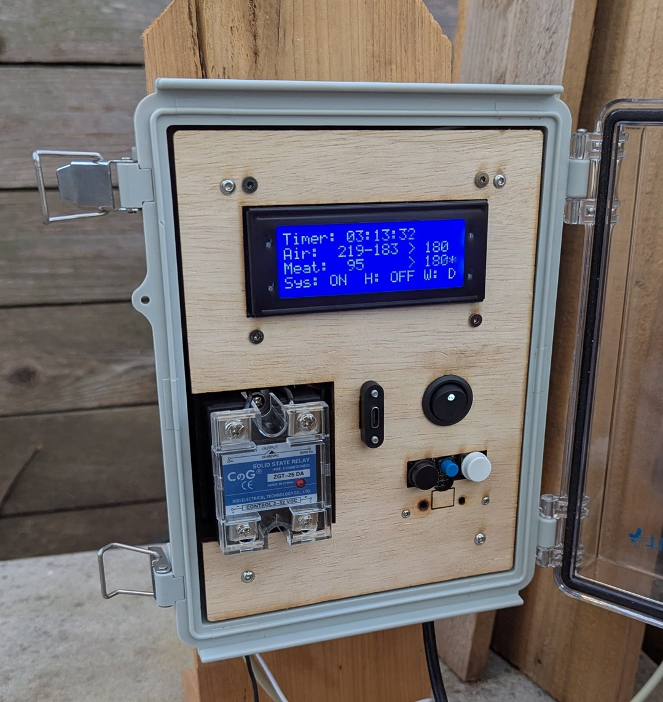

# OpenSmoker

### A completely open and hackable BBQ meat smoker controller

Welcome to a completely open BBQ meat smoker controller! With this you have control over the entire process, heating, fan, temperatures, and get alerts when different milestones are reached, and hack it into whatever you need!

## Inspiration

I am a builder and an avid meat lover.  I figured one day I shall start smoking meat (very soon after getting my own meat grinder for sausage making).  After seeing what's available on the market and at what prices, I decided it would be cheaper and funner to build my own smoker with a custom integrated controller that I can adapt and reprogram.  I wanted to automate as much as possible from the smoking process.  This is likely be an endless work-in-progress project, as I keep expanding its capabilities, but that is a good thing!

## Functionality

- LCD screen for displaying information and configuring settings
- 3 Temperature probes: 2 for air (top & bottom), 1 for meat
- Set target air and meat temperatures using buttons
- Automatic fan control for air circulation
- Reduce temperature when meat reaches target to prevent overcooking
- High heat detection and emergency shutdown (a.k.a. fire!)
- Panel mounted USB-C for easy reprogramming
- WiFi MQTT messaging for Home Assistant integration (WIP)
- Preset temperature profiles and configurations (WIP)

## Bill of Materials

Required:
1. Controller: Raspberry Pi Pico 2W
1. Temperature Sensors: 3x MAX6675 thermocouple amplifiers with k-type thermocouples
1. Display: 20x4 character LCD with I2C backpack
1. Heater Relay: Solid state relay SSR-25DA with heatsink 
1. Heating Element: 1200W 120VAC heater
1. Buttons: 3 standard momentary buttons
1. Switch: 5-12V rocker switch KCD2
1. DC Power Supply: DC 12V 1A power supply
1. DC 12V to 5V: L7805CV 5V voltage regulator

Optional:
1. Fan Relay: 5-36V MOSFET relay
1. Adafruit Terminal PiCowbell breakout board
1. Panel Mount Cable USB-C female to Micro-B male cable
1. Enclosure

## Links
1. Raspberry Pi Pico 2W: https://www.adafruit.com/product/6087
1. Adafruit Terminal PiCowbell breakout board: https://www.adafruit.com/product/5907
1. USB-C to Micro-USB panel mount cable: https://www.adafruit.com/product/4056
1. Thermocouple amplifiers: https://www.amazon.com/dp/B0C6QTL5Y3
1. Heater element: https://www.amazon.com/dp/B0BLV846DB
1. Heater relay: https://www.amazon.com/dp/B09GLRRGLT
1. Switch: https://www.amazon.com/dp/B08YWQWF2J 
1. 20x4 LCD: https://www.amazon.com/Hosyond-Module-Display-Arduino-Raspberry/dp/B0C1G9GBRZ

## Comments & Lessons Learned

- Parts decisions:
  - A lot of parts were used simply because I had them on hand.  
  - LCD: I had a few 20x4 LCDs, so I decided to try it.  It's not bad, but a little hard to read at angles, especially in direct sunlight. I will experiment with other displays I have laying around.  
  - Buttons: I initially tried to use a rotary encoder, but I was unable to get it working reliably enough, even with it being on its own CPU core, so I opted for a simpler 3-button control scheme.
  - Enclosure:  I had this weatherproof enclosure from another project, so figured I'd reuse it.  I laser-cut the front face plate out of 5mm plywood on my cheap Creality 5W laser cutter.  I 3D printed standoffs to 

- Arduino vs CircuitPython vs MicroPython:
  - I had trouble getting WiFi working correctly on Arduino with the RP2350, so moved to CircuitPython for good module support from AdaFruit.  However, CP does not have proper multi-core support, which is important for WiFi and other tasks not interfering with critical functions like the heater relay, so I switched to MicroPython.  With MP I was able to get multi-core and WiFi working easily, so I kept it as the programming language for this project.  CP libraries sometimes work with MP, so that simplifies compatability.
- DC Power:
  - I am using a 12V DC power supply and a 5V linear regulator to power the Pico and other components as needed (the LCD needs 5V).  I did this to have the availability of 12V to power a fan, which I have not done yet, but I have a 12V motor ready to go.  With 5V, I was unable to get a motor with enough torque and speed.  I am using a motor out of a broken robot vacuum

## Pictures

### Pinout:

### Internals:

Front face:

Spagetti wires:

Front panel backside:

Better inside view:

### My first smoke:

Lets get it started!

Separate meat thermometer for initial testing:

We have smoke! Latch broke, so using a plywood box to keep door shut. 

Getting color after about 90 minutes!

Ignore the terrible first attempt at a wood enclosure!  It will be greatly improved soon.  That will be another project here.
